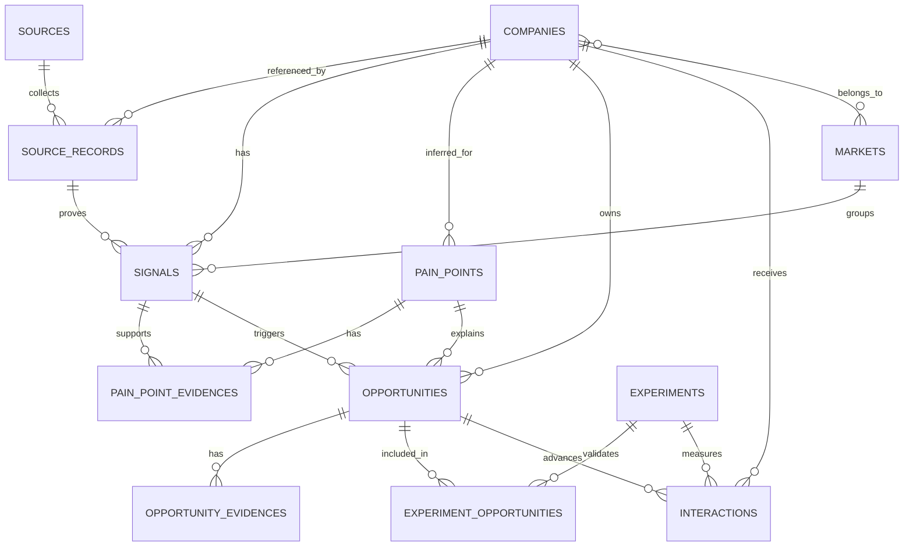

# 商脉 BizPulse V1 数据库设计

数据库：V1 默认 SQLite；模型使用 SQLAlchemy 2.x，可迁移 PostgreSQL。

## 设计原则

- **证据优先**：机会必须能回溯到 Signal / SourceRecord。
- **事实与推断分离**：Signal 默认是 FACT；PainPoint 默认是 INFERRED。
- **商业验证闭环**：Opportunity 最终通过 Experiment / Interaction 记录真实回复、报价、成交。
- **不造假数据**：初始化不写入任何企业或商机样例。
- **可审计**：关键写操作写入 `audit_logs`。

## 核心关系图

## 主业务链

`sources → source_records → companies → signals → pain_points → opportunities → experiments/interactions`

## `audit_logs` — 审计日志

| 字段 | 类型 | 可空 | 主键 | 外键 |
|---|---|---:|---:|---|
| `id` | `VARCHAR(32)` | 否 | 是 |  |
| `action` | `VARCHAR(100)` | 否 |  |  |
| `entity_type` | `VARCHAR(80)` | 是 |  |  |
| `entity_id` | `VARCHAR(64)` | 是 |  |  |
| `actor` | `VARCHAR(100)` | 否 |  |  |
| `payload_json` | `JSON` | 否 |  |  |
| `created_at` | `DATETIME` | 否 |  |  |
| `updated_at` | `DATETIME` | 否 |  |  |

## `companies` — 企业主表

| 字段 | 类型 | 可空 | 主键 | 外键 |
|---|---|---:|---:|---|
| `id` | `VARCHAR(32)` | 否 | 是 |  |
| `company_name` | `VARCHAR(300)` | 否 |  |  |
| `normalized_name` | `VARCHAR(300)` | 否 |  |  |
| `website` | `TEXT` | 是 |  |  |
| `domain` | `VARCHAR(255)` | 是 |  |  |
| `industry` | `VARCHAR(150)` | 是 |  |  |
| `sub_industry` | `VARCHAR(150)` | 是 |  |  |
| `country` | `VARCHAR(100)` | 是 |  |  |
| `province` | `VARCHAR(100)` | 是 |  |  |
| `city` | `VARCHAR(100)` | 是 |  |  |
| `employee_range` | `VARCHAR(100)` | 是 |  |  |
| `business_model` | `VARCHAR(100)` | 是 |  |  |
| `main_products` | `JSON` | 否 |  |  |
| `main_markets` | `JSON` | 否 |  |  |
| `company_description` | `TEXT` | 是 |  |  |
| `pulse_score` | `FLOAT` | 是 |  |  |
| `opportunity_level` | `VARCHAR(10)` | 是 |  |  |
| `status` | `VARCHAR(30)` | 否 |  |  |
| `source_count` | `INTEGER` | 否 |  |  |
| `created_at` | `DATETIME` | 否 |  |  |
| `updated_at` | `DATETIME` | 否 |  |  |

## `llm_runs` — AI分析运行记录

| 字段 | 类型 | 可空 | 主键 | 外键 |
|---|---|---:|---:|---|
| `id` | `VARCHAR(32)` | 否 | 是 |  |
| `module` | `VARCHAR(100)` | 否 |  |  |
| `target_type` | `VARCHAR(50)` | 是 |  |  |
| `target_id` | `VARCHAR(64)` | 是 |  |  |
| `prompt_name` | `VARCHAR(100)` | 是 |  |  |
| `prompt_version` | `VARCHAR(50)` | 是 |  |  |
| `model` | `VARCHAR(100)` | 是 |  |  |
| `provider` | `VARCHAR(100)` | 是 |  |  |
| `input_hash` | `VARCHAR(64)` | 是 |  |  |
| `output_json` | `JSON` | 否 |  |  |
| `tokens_input` | `INTEGER` | 是 |  |  |
| `tokens_output` | `INTEGER` | 是 |  |  |
| `cost_amount` | `NUMERIC(12, 4)` | 是 |  |  |
| `duration_seconds` | `FLOAT` | 是 |  |  |
| `status` | `VARCHAR(30)` | 否 |  |  |
| `error_message` | `TEXT` | 是 |  |  |
| `created_at` | `DATETIME` | 否 |  |  |
| `updated_at` | `DATETIME` | 否 |  |  |

## `markets` — 市场/细分场景

| 字段 | 类型 | 可空 | 主键 | 外键 |
|---|---|---:|---:|---|
| `id` | `VARCHAR(32)` | 否 | 是 |  |
| `market_name` | `VARCHAR(250)` | 否 |  |  |
| `slug` | `VARCHAR(250)` | 否 |  |  |
| `target_customer` | `TEXT` | 是 |  |  |
| `problem` | `TEXT` | 是 |  |  |
| `current_solution` | `TEXT` | 是 |  |  |
| `current_cost` | `VARCHAR(200)` | 是 |  |  |
| `frequency` | `VARCHAR(100)` | 是 |  |  |
| `willingness_to_pay` | `INTEGER` | 是 |  |  |
| `automation_fit` | `INTEGER` | 是 |  |  |
| `competition` | `INTEGER` | 是 |  |  |
| `entry_difficulty` | `INTEGER` | 是 |  |  |
| `market_score` | `FLOAT` | 是 |  |  |
| `validation_status` | `VARCHAR(30)` | 否 |  |  |
| `company_count` | `INTEGER` | 否 |  |  |
| `signal_count` | `INTEGER` | 否 |  |  |
| `high_value_company_count` | `INTEGER` | 否 |  |  |
| `created_at` | `DATETIME` | 否 |  |  |
| `updated_at` | `DATETIME` | 否 |  |  |

## `sources` — 数据源

| 字段 | 类型 | 可空 | 主键 | 外键 |
|---|---|---:|---:|---|
| `id` | `VARCHAR(32)` | 否 | 是 |  |
| `name` | `VARCHAR(200)` | 否 |  |  |
| `source_type` | `VARCHAR(50)` | 否 |  |  |
| `base_url` | `TEXT` | 是 |  |  |
| `reliability_grade` | `VARCHAR(1)` | 否 |  |  |
| `reliability_score` | `INTEGER` | 否 |  |  |
| `enabled` | `BOOLEAN` | 否 |  |  |
| `collector_type` | `VARCHAR(100)` | 是 |  |  |
| `collection_frequency` | `VARCHAR(100)` | 是 |  |  |
| `last_run_at` | `DATETIME` | 是 |  |  |
| `success_rate` | `FLOAT` | 是 |  |  |
| `notes` | `TEXT` | 是 |  |  |
| `created_at` | `DATETIME` | 否 |  |  |
| `updated_at` | `DATETIME` | 否 |  |  |

## `system_configs` — 系统配置

| 字段 | 类型 | 可空 | 主键 | 外键 |
|---|---|---:|---:|---|
| `id` | `INTEGER` | 否 | 是 |  |
| `key` | `VARCHAR(100)` | 否 |  |  |
| `value` | `TEXT` | 否 |  |  |
| `description` | `TEXT` | 是 |  |  |
| `created_at` | `DATETIME` | 否 |  |  |
| `updated_at` | `DATETIME` | 否 |  |  |

## `collection_jobs` — 采集任务

| 字段 | 类型 | 可空 | 主键 | 外键 |
|---|---|---:|---:|---|
| `id` | `VARCHAR(32)` | 否 | 是 |  |
| `source_id` | `VARCHAR(32)` | 是 |  | sources.id |
| `name` | `VARCHAR(300)` | 否 |  |  |
| `query` | `TEXT` | 是 |  |  |
| `keywords_json` | `JSON` | 否 |  |  |
| `status` | `VARCHAR(30)` | 否 |  |  |
| `progress` | `INTEGER` | 否 |  |  |
| `started_at` | `DATETIME` | 是 |  |  |
| `finished_at` | `DATETIME` | 是 |  |  |
| `record_count` | `INTEGER` | 否 |  |  |
| `error_count` | `INTEGER` | 否 |  |  |
| `error_message` | `TEXT` | 是 |  |  |
| `duration_seconds` | `FLOAT` | 是 |  |  |
| `created_at` | `DATETIME` | 否 |  |  |
| `updated_at` | `DATETIME` | 否 |  |  |

## `company_aliases` — 企业别名

| 字段 | 类型 | 可空 | 主键 | 外键 |
|---|---|---:|---:|---|
| `id` | `VARCHAR(32)` | 否 | 是 |  |
| `company_id` | `VARCHAR(32)` | 否 |  | companies.id |
| `alias` | `VARCHAR(300)` | 否 |  |  |
| `normalized_alias` | `VARCHAR(300)` | 否 |  |  |

## `company_markets` — 企业-市场关联

| 字段 | 类型 | 可空 | 主键 | 外键 |
|---|---|---:|---:|---|
| `company_id` | `VARCHAR(32)` | 否 | 是 | companies.id |
| `market_id` | `VARCHAR(32)` | 否 | 是 | markets.id |

## `experiments` — 商业验证实验

| 字段 | 类型 | 可空 | 主键 | 外键 |
|---|---|---:|---:|---|
| `id` | `VARCHAR(32)` | 否 | 是 |  |
| `name` | `VARCHAR(300)` | 否 |  |  |
| `description` | `TEXT` | 是 |  |  |
| `market_id` | `VARCHAR(32)` | 是 |  | markets.id |
| `hypothesis` | `TEXT` | 否 |  |  |
| `target_customer` | `TEXT` | 是 |  |  |
| `offer_name` | `VARCHAR(300)` | 是 |  |  |
| `pricing_hypothesis` | `VARCHAR(300)` | 是 |  |  |
| `target_company_count` | `INTEGER` | 否 |  |  |
| `status` | `VARCHAR(30)` | 否 |  |  |
| `conclusion` | `VARCHAR(30)` | 是 |  |  |
| `started_at` | `DATETIME` | 是 |  |  |
| `ended_at` | `DATETIME` | 是 |  |  |
| `created_at` | `DATETIME` | 否 |  |  |
| `updated_at` | `DATETIME` | 否 |  |  |

## `pain_points` — 潜在痛点

| 字段 | 类型 | 可空 | 主键 | 外键 |
|---|---|---:|---:|---|
| `id` | `VARCHAR(32)` | 否 | 是 |  |
| `company_id` | `VARCHAR(32)` | 否 |  | companies.id |
| `market_id` | `VARCHAR(32)` | 是 |  | markets.id |
| `category` | `VARCHAR(100)` | 否 |  |  |
| `description` | `TEXT` | 否 |  |  |
| `confidence` | `INTEGER` | 否 |  |  |
| `reason` | `TEXT` | 是 |  |  |
| `status` | `VARCHAR(30)` | 否 |  |  |
| `created_at` | `DATETIME` | 否 |  |  |
| `updated_at` | `DATETIME` | 否 |  |  |

## `source_records` — 原始证据记录

| 字段 | 类型 | 可空 | 主键 | 外键 |
|---|---|---:|---:|---|
| `id` | `VARCHAR(32)` | 否 | 是 |  |
| `source_id` | `VARCHAR(32)` | 否 |  | sources.id |
| `company_id` | `VARCHAR(32)` | 是 |  | companies.id |
| `url` | `TEXT` | 否 |  |  |
| `title` | `TEXT` | 是 |  |  |
| `raw_text` | `TEXT` | 是 |  |  |
| `raw_html_path` | `TEXT` | 是 |  |  |
| `published_at` | `DATETIME` | 是 |  |  |
| `collected_at` | `DATETIME` | 否 |  |  |
| `content_hash` | `VARCHAR(64)` | 否 |  |  |
| `http_status` | `INTEGER` | 是 |  |  |
| `language` | `VARCHAR(20)` | 是 |  |  |
| `metadata_json` | `JSON` | 否 |  |  |

## `company_contacts` — 企业公开联系人

| 字段 | 类型 | 可空 | 主键 | 外键 |
|---|---|---:|---:|---|
| `id` | `VARCHAR(32)` | 否 | 是 |  |
| `company_id` | `VARCHAR(32)` | 否 |  | companies.id |
| `name` | `VARCHAR(200)` | 是 |  |  |
| `title` | `VARCHAR(200)` | 是 |  |  |
| `department` | `VARCHAR(200)` | 是 |  |  |
| `public_contact` | `TEXT` | 是 |  |  |
| `source_record_id` | `VARCHAR(32)` | 是 |  | source_records.id |
| `confidence` | `INTEGER` | 否 |  |  |
| `verified_public` | `BOOLEAN` | 否 |  |  |
| `created_at` | `DATETIME` | 否 |  |  |
| `updated_at` | `DATETIME` | 否 |  |  |

## `signals` — 商业信号

| 字段 | 类型 | 可空 | 主键 | 外键 |
|---|---|---:|---:|---|
| `id` | `VARCHAR(32)` | 否 | 是 |  |
| `company_id` | `VARCHAR(32)` | 否 |  | companies.id |
| `market_id` | `VARCHAR(32)` | 是 |  | markets.id |
| `source_record_id` | `VARCHAR(32)` | 否 |  | source_records.id |
| `signal_type` | `VARCHAR(80)` | 否 |  |  |
| `title` | `VARCHAR(500)` | 否 |  |  |
| `description` | `TEXT` | 是 |  |  |
| `published_at` | `DATETIME` | 是 |  |  |
| `collected_at` | `DATETIME` | 否 |  |  |
| `confidence` | `INTEGER` | 否 |  |  |
| `reliability_score` | `INTEGER` | 否 |  |  |
| `heat_score` | `FLOAT` | 是 |  |  |
| `status` | `VARCHAR(30)` | 否 |  |  |
| `fact_or_inference` | `VARCHAR(20)` | 否 |  |  |
| `payload_json` | `JSON` | 否 |  |  |

## `opportunities` — 商业机会

| 字段 | 类型 | 可空 | 主键 | 外键 |
|---|---|---:|---:|---|
| `id` | `VARCHAR(32)` | 否 | 是 |  |
| `company_id` | `VARCHAR(32)` | 否 |  | companies.id |
| `market_id` | `VARCHAR(32)` | 是 |  | markets.id |
| `primary_signal_id` | `VARCHAR(32)` | 是 |  | signals.id |
| `pain_point_id` | `VARCHAR(32)` | 是 |  | pain_points.id |
| `title` | `VARCHAR(500)` | 否 |  |  |
| `problem` | `TEXT` | 否 |  |  |
| `solution` | `TEXT` | 否 |  |  |
| `value_proposition` | `TEXT` | 是 |  |  |
| `trigger_event` | `TEXT` | 是 |  |  |
| `purchase_intent` | `VARCHAR(50)` | 是 |  |  |
| `estimated_budget_level` | `VARCHAR(50)` | 是 |  |  |
| `budget_hypothesis_text` | `TEXT` | 是 |  |  |
| `pain_score` | `INTEGER` | 否 |  |  |
| `budget_score` | `INTEGER` | 否 |  |  |
| `intent_score` | `INTEGER` | 否 |  |  |
| `urgency_score` | `INTEGER` | 否 |  |  |
| `agent_fit_score` | `INTEGER` | 否 |  |  |
| `reachability_score` | `INTEGER` | 否 |  |  |
| `evidence_score` | `INTEGER` | 否 |  |  |
| `total_score` | `FLOAT` | 否 |  |  |
| `grade` | `VARCHAR(5)` | 否 |  |  |
| `confidence` | `INTEGER` | 否 |  |  |
| `stage` | `VARCHAR(30)` | 否 |  |  |
| `status` | `VARCHAR(30)` | 否 |  |  |
| `owner` | `VARCHAR(200)` | 是 |  |  |
| `created_at` | `DATETIME` | 否 |  |  |
| `updated_at` | `DATETIME` | 否 |  |  |

## `pain_point_evidences` — 痛点证据

| 字段 | 类型 | 可空 | 主键 | 外键 |
|---|---|---:|---:|---|
| `id` | `VARCHAR(32)` | 否 | 是 |  |
| `pain_point_id` | `VARCHAR(32)` | 否 |  | pain_points.id |
| `signal_id` | `VARCHAR(32)` | 是 |  | signals.id |
| `source_record_id` | `VARCHAR(32)` | 是 |  | source_records.id |
| `evidence_excerpt` | `TEXT` | 是 |  |  |

## `experiment_opportunities` — 实验-机会关联

| 字段 | 类型 | 可空 | 主键 | 外键 |
|---|---|---:|---:|---|
| `id` | `VARCHAR(32)` | 否 | 是 |  |
| `experiment_id` | `VARCHAR(32)` | 否 |  | experiments.id |
| `opportunity_id` | `VARCHAR(32)` | 否 |  | opportunities.id |
| `status` | `VARCHAR(30)` | 否 |  |  |

## `interactions` — 客户交互/成交反馈

| 字段 | 类型 | 可空 | 主键 | 外键 |
|---|---|---:|---:|---|
| `id` | `VARCHAR(32)` | 否 | 是 |  |
| `company_id` | `VARCHAR(32)` | 否 |  | companies.id |
| `opportunity_id` | `VARCHAR(32)` | 是 |  | opportunities.id |
| `experiment_id` | `VARCHAR(32)` | 是 |  | experiments.id |
| `channel` | `VARCHAR(50)` | 否 |  |  |
| `contact_at` | `DATETIME` | 是 |  |  |
| `contact_name` | `VARCHAR(200)` | 是 |  |  |
| `contact_title` | `VARCHAR(200)` | 是 |  |  |
| `response_summary` | `TEXT` | 是 |  |  |
| `response_type` | `VARCHAR(50)` | 是 |  |  |
| `meeting` | `BOOLEAN` | 否 |  |  |
| `quote_amount` | `NUMERIC(14, 2)` | 是 |  |  |
| `deal` | `BOOLEAN` | 否 |  |  |
| `revenue` | `NUMERIC(14, 2)` | 是 |  |  |
| `reject_reason` | `VARCHAR(80)` | 是 |  |  |
| `notes` | `TEXT` | 是 |  |  |
| `created_at` | `DATETIME` | 否 |  |  |
| `updated_at` | `DATETIME` | 否 |  |  |

## `opportunity_evidences` — 机会证据

| 字段 | 类型 | 可空 | 主键 | 外键 |
|---|---|---:|---:|---|
| `id` | `VARCHAR(32)` | 否 | 是 |  |
| `opportunity_id` | `VARCHAR(32)` | 否 |  | opportunities.id |
| `source_record_id` | `VARCHAR(32)` | 是 |  | source_records.id |
| `signal_id` | `VARCHAR(32)` | 是 |  | signals.id |
| `evidence_type` | `VARCHAR(50)` | 否 |  |  |
| `evidence_excerpt` | `TEXT` | 是 |  |  |
| `weight` | `INTEGER` | 否 |  |  |

## 机会评分字段说明

| 字段 | 权重 |
|---|---:|
| `pain_score` | 25% |
| `budget_score` | 20% |
| `intent_score` | 20% |
| `urgency_score` | 10% |
| `agent_fit_score` | 10% |
| `reachability_score` | 5% |
| `evidence_score` | 10% |

**Evidence < 60 时，最终等级最高只能为 B。**

## Opportunity 阶段

`NEW → PENDING_REVIEW → READY → CONTACTED → REPLIED → MEETING → QUOTED → WON / REJECTED`

## 数据可靠性

- A：官方站点、政府、交易所、官方采购等。
- B：大型招聘平台、权威媒体、行业协会等。
- C：社区、论坛、社交平台。
- D：二次转载或来源难确认。
